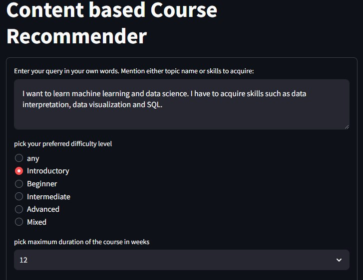
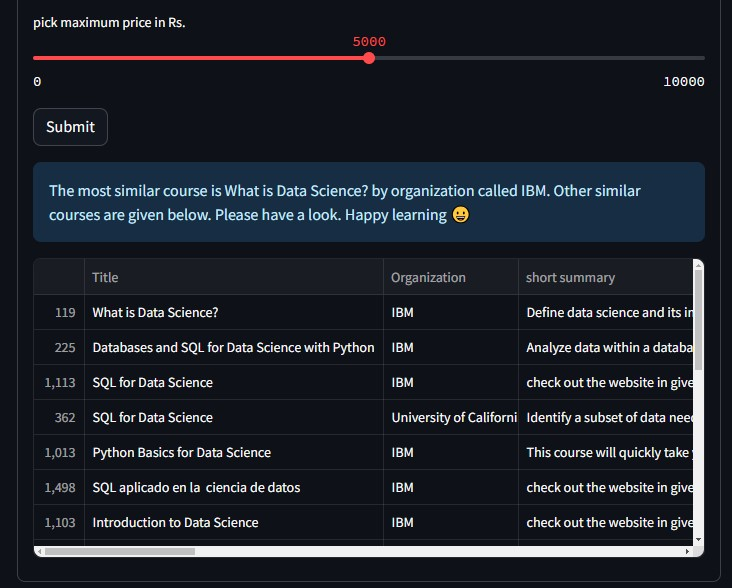
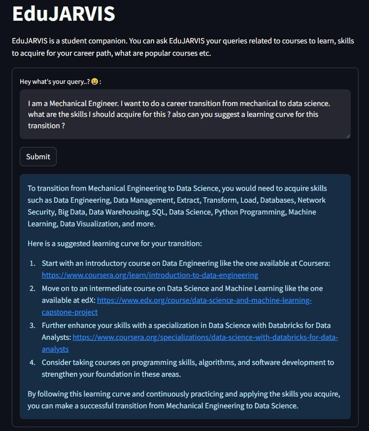
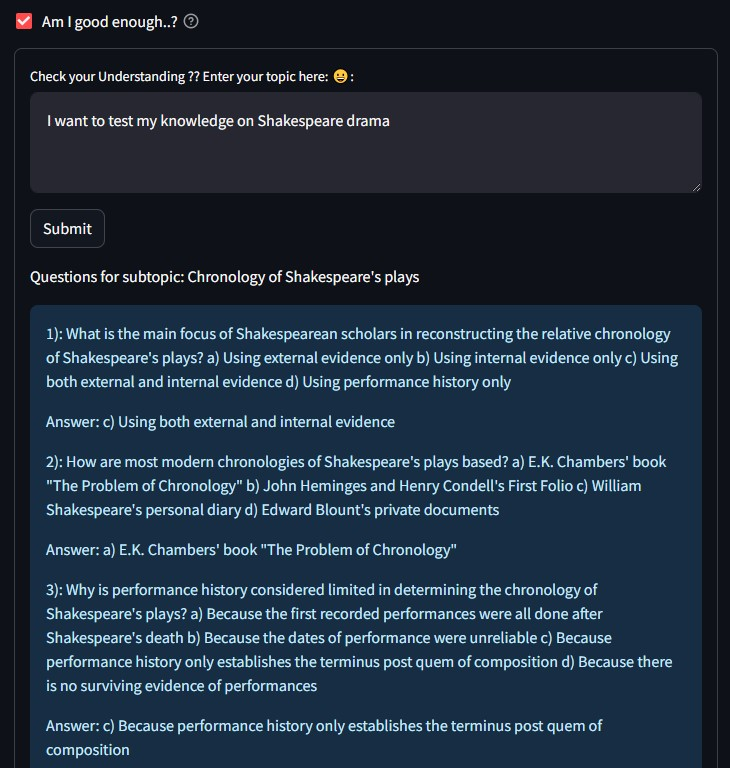
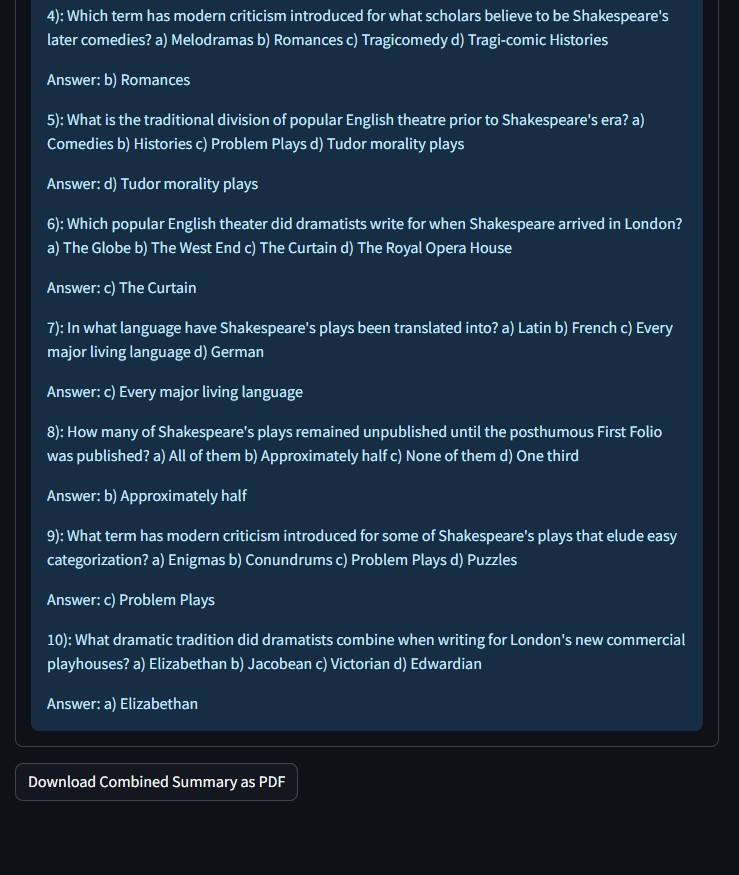

# Presentation slides: 
https://github.com/KiranEC11/ET-623-Project-student-companion/blob/main/presentation/ET623_TEAM12.pdf

________________________________________________________

# Demo Videos:
## - Content based Course recommender: https://drive.google.com/file/d/1X4oPzvCBPk92dUcXIp_bg8iF1RHfufDN/view?usp=drive_link

## - Edu-JARVIS: a chatbot for queries related to skills to acquire, courses to learn, suggesting learning curve etc. : https://drive.google.com/file/d/1TTCvXwCMrr4Z5si07kqk8nFVF5RT1umV/view?usp=drive_link

## - Question & Answer generator: https://drive.google.com/file/d/1KbdACXDGqzxrgek3rpuil9EKRcbB08iK/view?usp=drive_link

